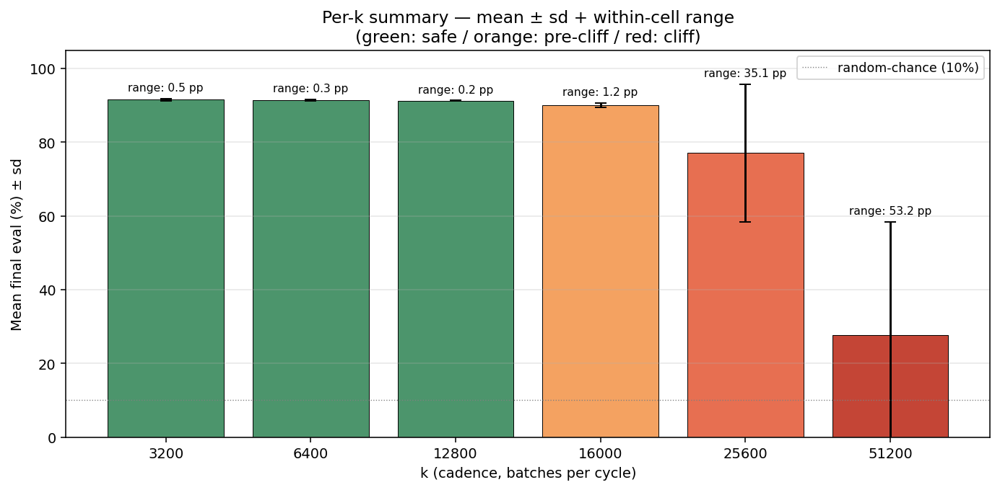
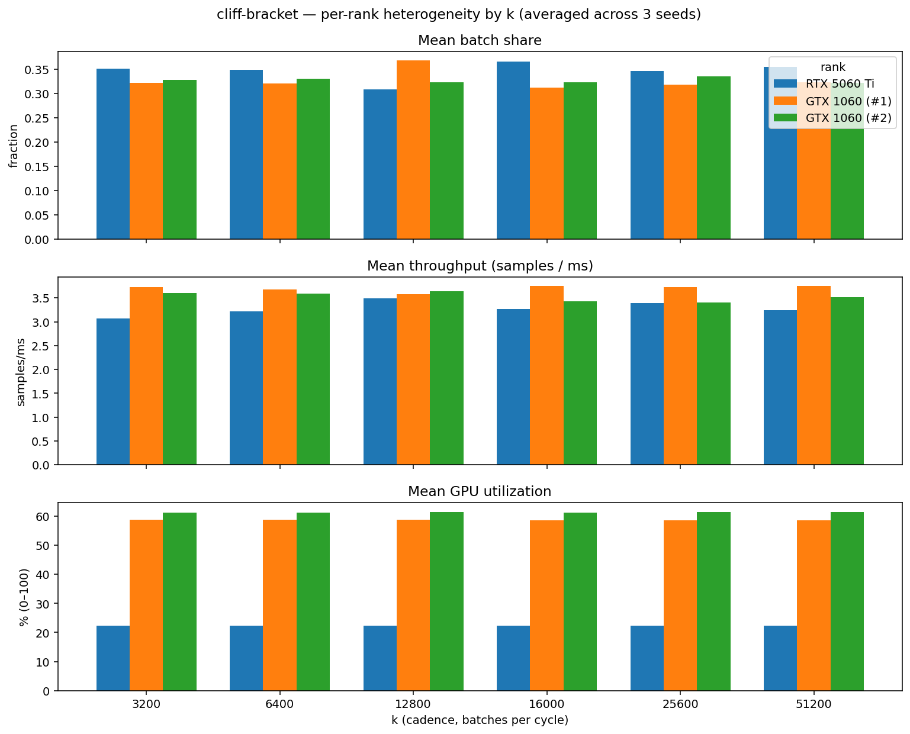

# cliff-bracket — analysis

18 cells = 3 seeds × 6 fixed-k values, on ResNet-20 / CIFAR-10 /
200 epochs / nccl-async / 3-GPU heterogeneous (1× RTX 5060 Ti +
2× GTX 1060). Cadence is pinned at exactly `k` batches per cycle via
`--min-anchor=k --max-anchor=k --guard none`. The convergence guard
is disabled for the duration of every cell, so the auto-tune cannot
steer cadence away from the pinned value.

The sweep walks `k` across an order of magnitude (3200 → 51200) to
locate the synchronization threshold empirically. ElChe's auto-tuned
cadence saturates near `k ≈ 200` in normal operation; this sweep
operates 16–250× above that setpoint.

## Meta unified view

### Per-k summary

| k | seed 0 | seed 1 | seed 2 | mean ± sd | range | syncs (mean) |
|---:|---:|---:|---:|---:|---:|---:|
| 3200 | 91.76% | 91.76% | 91.28% | 91.60% ± 0.28 pp | 0.5 pp | 13 |
| 6400 | 91.31% | 91.39% | 91.64% | 91.45% ± 0.17 pp | 0.3 pp | 7 |
| 12800 | 91.29% | 91.37% | 91.21% | 91.29% ± 0.08 pp | 0.2 pp | 4 |
| 16000 | 90.31% | 89.32% | 90.53% | 90.05% ± 0.64 pp | 1.2 pp | 3 |
| 25600 | 90.89% | 55.80% | 84.58% | 77.09% ± 18.71 pp | 35.1 pp | 2 |
| 51200 | 63.22% | 10.02% | 10.02% | 27.75% ± 30.72 pp | 53.2 pp | 1 |

Per-cell evals shown for each of the 3 seeds, plus mean ± sd, range,
and mean sync count over the 200-epoch run.

Bar height is the per-k mean eval; error bars are seed-to-seed
standard deviation; "range" annotation above each bar is the within-
cell max minus min. Color encodes the regime classification: green =
safe (k ≤ 12800), orange = pre-cliff soft-drop (k = 16000), red =
cliff edge or beyond (k ≥ 25600).

### Eval vs k (cliff bracket)

X-axis is log-scaled to span the order-of-magnitude k range. Each
seed has its own marker; per-k mean is the black tick, per-k range is
the grey vertical line. The shaded region marks the cliff bracket
(k = 16000 ↔ k = 25600) — the safe / unsafe boundary.

### Adjacent-cell deltas

| transition | Δ mean eval | verdict |
|---|---:|---|
| k = 3200 → 6400 | -0.15 pp | flat |
| k = 6400 → 12800 | -0.16 pp | flat |
| k = 12800 → 16000 | -1.24 pp | soft drop (>1 pp) |
| k = 16000 → 25600 | -12.96 pp | steep drop |
| k = 25600 → 51200 | -49.34 pp | cliff edge (>30 pp) |

Δ between consecutive k values, color-coded by verdict. The cliff
edge is the first transition with Δ > 30 pp.

## Individual GPU view

### Per-rank averages (across all 18 cells)

| rank | GPU | mean share | mean throughput (samples/ms) | mean util | peak VRAM |
|---|---|---:|---:|---:|---:|
| 0 | RTX 5060 Ti | 0.346 ± 0.038 | 3.28 ± 0.24 | 22.3% | 356 MB |
| 1 | GTX 1060 (#1) | 0.327 ± 0.026 | 3.70 ± 0.16 | 58.7% | 398 MB |
| 2 | GTX 1060 (#2) | 0.327 ± 0.023 | 3.53 ± 0.16 | 61.4% | 399 MB |

Mean ± standard deviation across cells. Note that under fixed-k +
guard-none the cadence is constant by construction, so the
heterogeneity here is driven entirely by ElChe's progressive
batch-share dispatch (still active under fixed-k).

### Per-rank metrics by k

Three panels (share, throughput, GPU utilization). Within each panel,
each k has three adjacent bars (one per rank). Cells past the cliff
(k ≥ 25600) reach only ≤ 2 sync events in the 200-epoch run, which
shows up as a regime change in the per-rank dynamics.

## Key observations

- **The synchronization threshold sits between k = 16000 and k = 25600**.
  At k = 16000 all 3 seeds finish within ~1.3 pp of the safe-regime
  mean (mean 90.05%).
  At k = 25600 the within-cell range jumps to 35.1 pp:
  three independently-seeded runs landing at distinct evals is the
  basin-of-attraction signature of a noise-perturbed system at the
  threshold.
- **Hard collapse at k = 51200**.  The k = 51200 cell sees only 1
  AllReduce event in the 200-epoch run; mean eval falls to
  27.75% with two of three seeds essentially at random
  chance (10%).
- **Adjacent-cell delta gradient localizes the cliff edge**. The first
  soft drop (>1 pp) happens at k = 12800 → 16000
  (-1.24 pp); the first major drop sits at
  k = 16000 → 25600 (-12.96 pp); the cliff edge
  itself (Δ > 30 pp) is k = 25600 → 51200
  (-49.34 pp).
- **No eval peak above the auto-tune setpoint in the safe regime**.
  Across k ∈ {3200, 6400, 12800}, eval is monotone non-increasing
  (91.60% → 91.45% →
  91.29%). The "ride the limit" hypothesis —
  that eval has a peak somewhere between the auto-tune's natural
  setpoint and the cliff — is not supported. The safe controller story
  is "stay below the cliff", not "target a peak".
- **Cross-rank Pearson r becomes uninformative past the cliff**. Cells
  with ≤ 2 within-training sync events have only 2 data points to
  correlate, so r is mathematically ±1 by construction; reported
  values for k ≥ 25600 should be read as a sample-size artifact, not
  a framing-validity signal.

## Source data

- `per_cell.csv` — 18 rows (one per cell), with seed, k, eval,
  syncs, Pearson r, per-rank metrics.
- `per_rank.csv` — 54 rows = 18 cells × 3 ranks.
- `cliff_bracket.png`, `adjacent_deltas.png`,
  `per_rank_heterogeneity.png` — the figures embedded above.
- The full per-LR-window aggregator output (slopes, R², per-rank
  ratio, etc.) is in [`aggregate.txt`](aggregate.txt).

## Reproducibility

Run from this directory: `python3 analyze.py`. Reads cell extracts in
this directory; writes outputs to `analysis/`. See
[`../README.md`](../README.md) for the sweep-level reproducibility
recipe.
