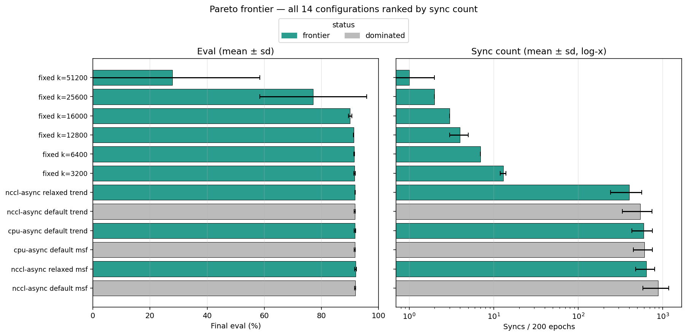
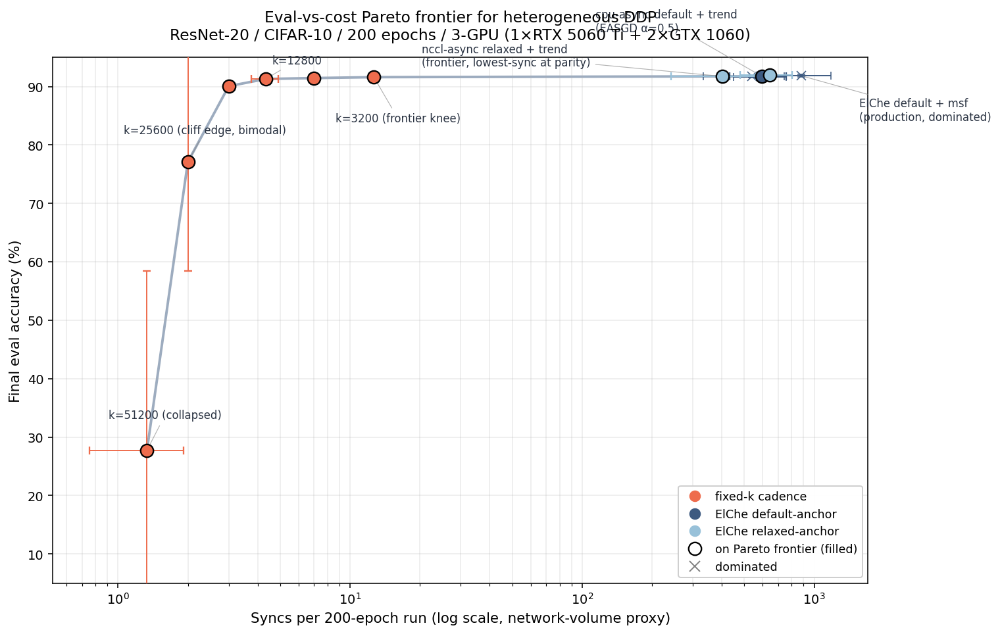
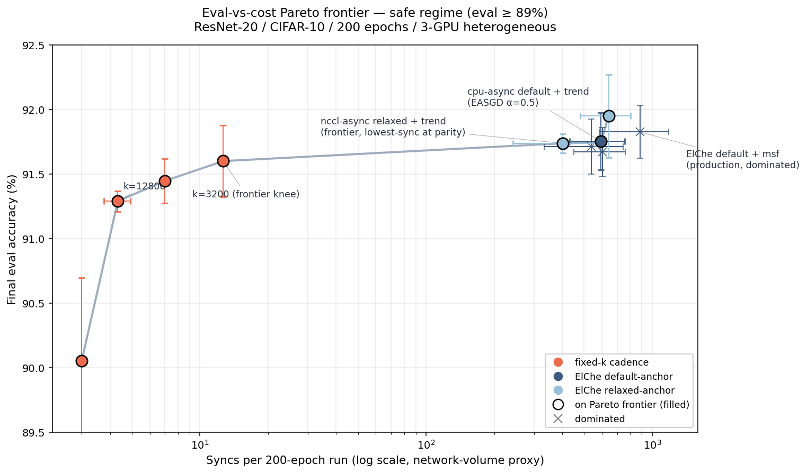

# pareto-frontier — analysis

The Pareto frontier is the cross-sweep eval-vs-cost characterization.
Cost axis: AllReduce events per 200-epoch run (a network-volume proxy
that stays meaningful at fixed model size; rotates toward wall-time
as parameter count grows). Eval axis: held-out CIFAR-10 test
accuracy.

Configurations span three upstream sweeps:

- [`../passive-observation/`](../passive-observation/) — default-anchor
  cells (20 cells: 5 seeds × 2 modes × 2 guards on nccl-async +
  cpu-async; cpu-async cohort uses EASGD α=0.5 elastic blending).
- [`../relaxed-anchor/`](../relaxed-anchor/) — `--elche-relax-up`
  cells (10 cells: 5 seeds × 2 guards × nccl-async).
- [`../cliff-bracket/`](../cliff-bracket/) — fixed-k cliff probe
  (18 cells: 3 seeds × 6 k values).

## Cross-sweep frontier table

| config | n | eval (%) | syncs / 200 ep | status |
|---|---:|---:|---:|---|
| `fixed k=51200` | 3 | 27.75 ± 30.72 | 1 ± 1 | **frontier** |
| `fixed k=25600` | 3 | 77.09 ± 18.71 | 2 ± 0 | **frontier** |
| `fixed k=16000` | 3 | 90.05 ± 0.64 | 3 ± 0 | **frontier** |
| `fixed k=12800` | 3 | 91.29 ± 0.08 | 4 ± 1 | **frontier** |
| `fixed k=6400` | 3 | 91.45 ± 0.17 | 7 ± 0 | **frontier** |
| `fixed k=3200` | 3 | 91.60 ± 0.28 | 13 ± 1 | **frontier** |
| `nccl-async relaxed trend` | 5 | 91.74 ± 0.07 | 402 ± 160 | **frontier** |
| `nccl-async default trend` | 5 | 91.71 ± 0.21 | 539 ± 205 | dominated by nccl-async relaxed trend |
| `cpu-async default trend` | 5 | 91.75 ± 0.22 | 594 ± 162 | **frontier** |
| `cpu-async default msf` | 5 | 91.67 ± 0.19 | 604 ± 154 | dominated by nccl-async relaxed trend |
| `nccl-async relaxed msf` | 5 | 91.95 ± 0.32 | 641 ± 162 | **frontier** |
| `nccl-async default msf` | 5 | 91.83 ± 0.20 | 882 ± 299 | dominated by nccl-async relaxed msf |

Sorted by mean sync count, ascending. Per-config aggregates are
mean ± standard deviation across seeds. Status is the Pareto-frontier
classification: a configuration is dominated when another has
strictly better (or equal) eval at strictly lower sync count.

Direct table-companion: each row of the table above corresponds to a
horizontal bar pair (eval on the left panel, syncs on the right,
log-x). Rows are sorted by sync count, matching the table order.
Frontier configurations in green; dominated in grey.

## Pareto figure (full + safe-regime zoom)

Full Pareto plot. X-axis is log-scaled syncs / 200 epochs. The fixed-k
cells span the low-sync end (1–13 syncs); the auto-tuned cells cluster
in the high-sync band (~400–900 syncs). Past the cliff, fixed-k cells
collapse to ≪ random-chance accuracy.

Safe-regime zoom — the auto-tune cluster in the high-sync band, with
the frontier knee visible at the low-sync end of the safe regime.

## Key observations

- **The frontier is 9 configurations of 12 total** (48 cells across the four upstream sweeps).
- **Eval maximum sits at `nccl-async relaxed msf`** (91.95% ± 0.32, 641 ± 162 syncs).
- **Lowest-sync near-parity point is `nccl-async relaxed trend`** (91.74%, 402 syncs) — trades a small eval drop for a sync-count reduction at the high-sync end.
- **Production default `nccl-async default msf` (91.83%, 882 syncs) is dominated by `nccl-async relaxed msf`** — the production-config improvement is a backend swap, not a coupling-mechanism change.
- **Fixed-k cells dominate the low-sync end** by construction: pinning the cadence at `k` produces ~`200/k` syncs per 200-epoch run, three orders of magnitude below the auto-tuned regime. The cliff-localization sweep at [`../cliff-bracket/`](../cliff-bracket/) shows this is also where the synchronization threshold lives.

## Source data

- [`../pareto.py`](../pareto.py) — the cross-sweep aggregator. Reads
  `report.md` from the four upstream sweep extracts.
- [`../pareto.txt`](../pareto.txt) — canonical text output.
- [`../pareto.png`](../pareto.png) and
  [`../pareto-safe-zoom.png`](../pareto-safe-zoom.png) — the figures
  embedded above.

## Reproducibility

Run from this directory: `python3 analyze.py`. The wrapper invokes
`pareto.py` from the project root (regenerating `pareto.txt` plus the
two PNGs in the parent directory) and then writes this curated
`README.md`. See [`../README.md`](../README.md) for the directory-level
recipe.
