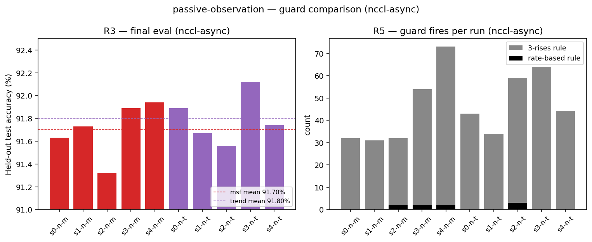
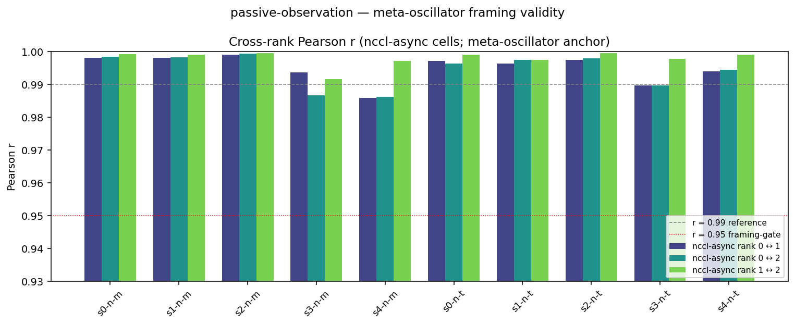
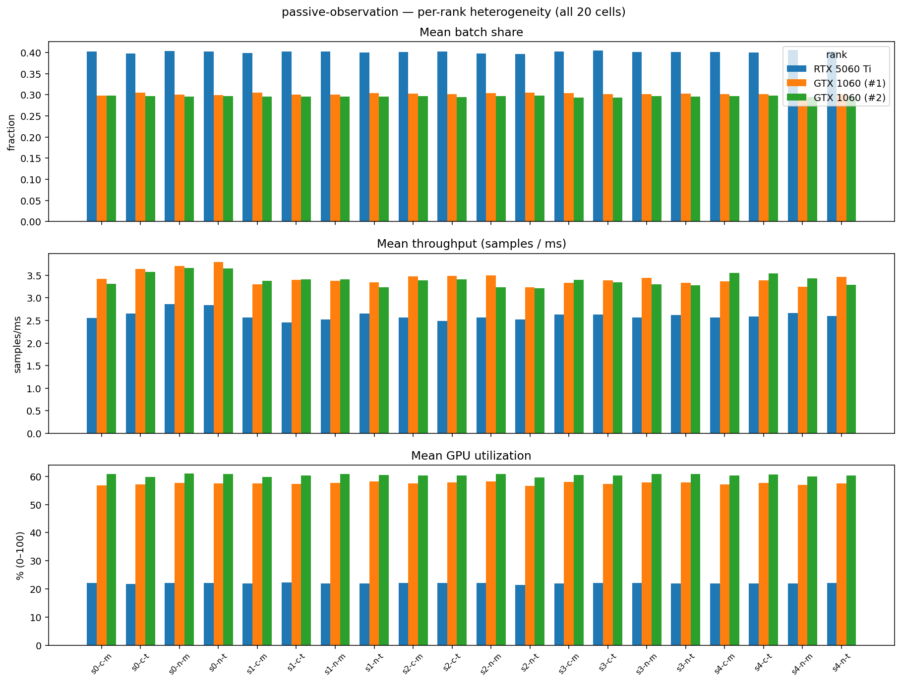

# passive-observation — analysis

20 cells: 5 seeds (0–4) × 2 modes (`cpu-async`, `nccl-async`) × 2
guards (`msf`, `trend`), on ResNet-20 / CIFAR-10 / 200 epochs.
Hardware: 1× RTX 5060 Ti (16 GB) + 2× GTX 1060 (6 GB each). Default
anchor; no relax-up; no EASGD blending.

The `cpu-async` cohort (10 cells) is retained as a foil rather than
primary data: the 3-phase pipelined averaging on this backend breaks
the impulsive-coupling assumption that anchors the meta-oscillator
framing. The `nccl-async` cohort (10 cells) is the primary
subset for the verdicts on `R3` (final eval), `R5` (guard
fires), and the meta-oscillator anchor (cross-rank Pearson r).

## Meta unified view

### Summary (nccl-async, guard comparison)

| guard | n cells | mean eval | mean syncs | mean fires (3-rises) | mean fires (rate-based) |
|---|---:|---:|---:|---:|---:|
| `msf`   | 5 | 91.70% ± 0.25 pp | 671 ± 242 | 44.4 ± 18.7 | 1.2 ± 1.1 |
| `trend` | 5 | 91.80% ± 0.22 pp | 676 ± 104 | 48.8 ± 12.4 | 0.6 ± 1.3 |

### Eval and guard fires per cell

Left panel: per-cell final eval, color-coded by guard, with both
guards' sweep-mean shown as dashed lines. Right panel: guard fires per
run for both detectors on the same cells.

### Cross-rank Pearson r (meta-oscillator anchor)

| pair | mean r ± sd | min | max |
|---|---:|---:|---:|
| rank 0 ↔ 1 | +0.9950 ± 0.0043 | +0.9859 | +0.9991 |
| rank 0 ↔ 2 | +0.9946 ± 0.0051 | +0.9863 | +0.9995 |
| rank 1 ↔ 2 | +0.9980 ± 0.0024 | +0.9916 | +0.9996 |

Cross-rank Pearson r per pair across all 10 nccl-async cells.
Reference lines: r = 0.99 (empirical anchor across the sweep) and
r = 0.95 (framing-validity gate; below this the meta-oscillator
framing breaks and per-rank treatment is required).

## Individual GPU view

### Per-rank averages (across all 20 cells)

| rank | GPU | mean share | mean throughput (samples/ms) | mean util | peak VRAM |
|---|---|---:|---:|---:|---:|
| 0 | RTX 5060 Ti | 0.401 ± 0.002 | 2.60 ± 0.10 | 22.0% | 357 MB |
| 1 | GTX 1060 (#1) | 0.302 ± 0.002 | 3.43 ± 0.14 | 57.5% | 397 MB |
| 2 | GTX 1060 (#2) | 0.296 ± 0.001 | 3.40 ± 0.14 | 60.4% | 388 MB |

Mean ± standard deviation across cells. Peak VRAM is the maximum
allocated by libtorch over the run, sampled at ~100 ms intervals from
`timeline.csv.gz`.

### Per-rank heterogeneity per cell

Three panels (share, throughput, GPU utilization). Within each panel,
every cell has three adjacent bars (one per rank). Color encodes the
GPU. Cell labels: `s{seed}-{c|n}-{m|t}` where `c` = cpu-async,
`n` = nccl-async, `m` = msf, `t` = trend.

## Key observations

- **Cross-rank Pearson r anchors the meta-oscillator framing**. Across
  all 10 `nccl-async` cells, every rank pair stays at
  r > 0.9859 (mean r ≥ 0.9946 on the lowest-mean
  pair). The framing-validity gate at r = 0.95 is comfortably
  non-binding — ranks behave as coupled views of one D-trajectory,
  not as independent oscillators.
- **The rate-based detector fires ~37× less
  than the 3-rises rule at no eval cost**. On the
  5 msf-guard cells (where the rate-based detector is
  the active gate), mean fires per 200-epoch run:
  44.4 (3-rises rule) vs
  1.2 (rate-based). Final eval is
  statistically equivalent across guards (Δ = -0.09 pp,
  within seed sd ≈ 0.20 pp). The aggregator output in
  [`aggregate.txt`](aggregate.txt) reports a slightly higher reduction
  ratio (98.2%) because its detector-table parser excludes one cell
  whose "both-fired" column carried a multi-event list rather than a
  single count.
- **Heterogeneous load balancing visible**. The fast GPU (rank 0,
  RTX 5060 Ti) carries a mean batch share of
  0.40 but runs at
  22% mean
  GPU utilization; the slow GPUs (ranks 1, 2, GTX 1060) take
  0.30 /
0.30 and run at
  58% /
60% utilization.

## Source data

- `per_cell.csv` — one row per cell (20 rows): includes mode, guard,
  eval, syncs, guard-fire counts, cross-rank Pearson r, per-rank
  shares + throughputs + GPU utilization + VRAM peaks.
- `per_rank.csv` — one row per (cell, rank), 60 rows total.
- `guard_comparison.png`, `meta_oscillator_pearson.png`,
  `per_rank_heterogeneity.png` — the figures embedded above.

## Reproducibility

Run from the sweep directory: `python3 analyze.py`. Reads the cell
extracts in this directory; writes outputs to `analysis/`. See
[`../README.md`](../README.md) for the sweep-level reproducibility
recipe.
