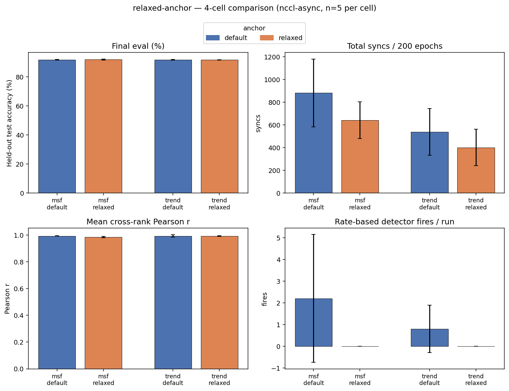
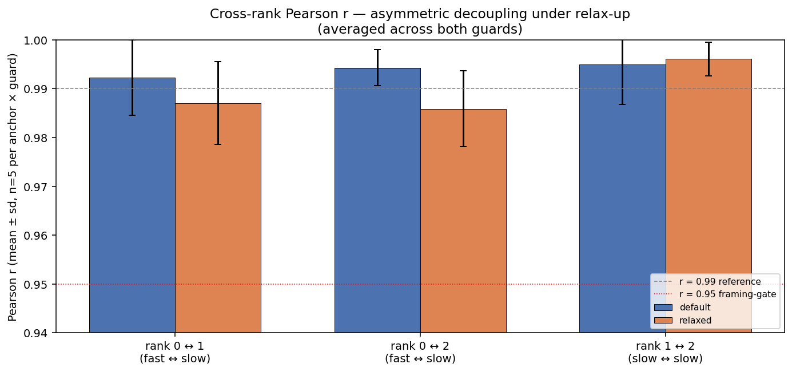
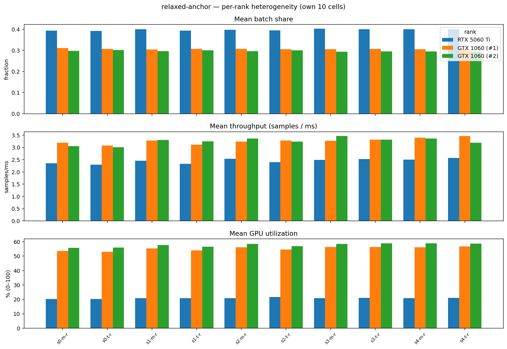

# relaxed-anchor — analysis

10 cells: 5 seeds × 2 guards (`msf`, `trend`) on nccl-async with
`--elche-relax-up`. Compared head-to-head against the default-anchor
baseline (10 corresponding cells in `../passive-observation/`).

Model / dataset / hardware as in `../passive-observation/README.md`.

## Meta unified view

### 4-cell summary (default vs relaxed × msf vs trend, nccl-async)

| guard | anchor | n | final eval | syncs | Pearson r (3-pair mean) | rate-based fires |
|---|---|---:|---:|---:|---:|---:|
| `msf` | default | 5 | 91.83% ± 0.20 pp | 882 ± 299 | 0.9940 ± 0.0012 | 2.2 ± 2.9 |
| `msf` | relaxed | 5 | 91.95% ± 0.32 pp | 641 ± 162 | 0.9862 ± 0.0052 | 0.0 ± 0.0 |
| `trend` | default | 5 | 91.71% ± 0.21 pp | 539 ± 205 | 0.9936 ± 0.0084 | 0.8 ± 1.1 |
| `trend` | relaxed | 5 | 91.74% ± 0.07 pp | 402 ± 160 | 0.9931 ± 0.0034 | 0.0 ± 0.0 |

`anchor=default` cells are read from
[`../passive-observation/`](../passive-observation/) for the
head-to-head comparison; `anchor=relaxed` cells are own cells in this
sweep. n = 5 seeds per condition.

Four panels: final eval, total syncs, mean cross-rank Pearson r,
and rate-based detector fires per run. Color encodes the anchor mode.
Error bars are seed-to-seed standard deviation.

### Asymmetric Pearson r decoupling under relax-up

| pair | default mean ± sd | relaxed mean ± sd | Δ |
|---|---:|---:|---:|
| rank 0 ↔ 1 (fast ↔ slow) | +0.9923 ± 0.0077 | +0.9870 ± 0.0084 | -0.0052 |
| rank 0 ↔ 2 (fast ↔ slow) | +0.9943 ± 0.0037 | +0.9859 ± 0.0078 | -0.0084 |
| rank 1 ↔ 2 (slow ↔ slow) | +0.9949 ± 0.0081 | +0.9961 ± 0.0034 | +0.0011 |

Mean across all 5 seeds × 2 guards = 10 cells per anchor. Δ is
relaxed minus default.

Hardware heterogeneity dictates the decoupling direction: fast ↔ slow
pairs lose correlation under relax-up, while the slow ↔ slow pair
stays perfectly locked. This is a publishable empirical fact about
heterogeneous-DDP synchronization with no homogeneous-cluster analog.

## Individual GPU view

### Per-rank averages (across own 10 cells)

| rank | GPU | mean share | mean throughput (samples/ms) | mean util | peak VRAM |
|---|---|---:|---:|---:|---:|
| 0 | RTX 5060 Ti | 0.397 ± 0.004 | 2.45 ± 0.10 | 20.9% | 356 MB |
| 1 | GTX 1060 (#1) | 0.306 ± 0.002 | 3.26 ± 0.12 | 55.2% | 395 MB |
| 2 | GTX 1060 (#2) | 0.297 ± 0.003 | 3.26 ± 0.14 | 57.6% | 386 MB |

Mean ± standard deviation across cells. Peak VRAM is the maximum
allocated by libtorch over the run, sampled at ~100 ms intervals from
`timeline.csv.gz`.

### Per-rank heterogeneity per cell

Three panels (share, throughput, GPU utilization). Cell labels:
`s{seed}-{m|t}-r` where `m`/`t` = msf/trend guard, `r` = relaxed-anchor.

## Key observations

- **Relaxed anchor preserves eval at lower sync count**. Under the
  msf guard, the relaxed-anchor cohort sits at
  91.95% eval vs
  91.83% for default-anchor
  (Δ = +0.12 pp), with a
  27% sync-count reduction
  (882 → 641).
- **Hardware heterogeneity dictates decoupling direction**. The
  cross-rank Pearson r drop under relax-up is asymmetric: fast ↔ slow
  pairs (rank 0 against ranks 1, 2) shed
  0.005 of correlation, while the slow ↔ slow
  pair (ranks 1, 2) loses essentially nothing
  (+0.0011). The fast GPU runs farthest ahead between
  syncs, so it drifts most when cadence loosens; the two slow GPUs
  stay anchored to the same plodding pace.
- **The rate-based detector goes silent under relax-up on the msf
  guard**. 5 of 5 relaxed
  msf-guard seeds have zero rate-based fires across the 200-epoch run.
  Combined with the relax-up policy (each "stable" verdict grows the
  anchor), this composes into unbounded anchor growth on those seeds —
  motivating a threshold-aware controller for production deployment.
- **Heterogeneous load balancing visible**. The fast GPU (rank 0,
  RTX 5060 Ti) carries a mean batch share of
  0.40 but runs at
  21% mean
  GPU utilization; the slow GPUs (ranks 1, 2, GTX 1060) take
  0.31 /
0.30 and run at
  55% /
58% utilization.

## Source data

- `per_cell.csv` — 10 rows (own cells only), with mode, guard,
  anchor, eval, syncs, Pearson r, guard fires, per-rank metrics.
- `per_rank.csv` — 30 rows = 10 cells × 3 ranks.
- `four_cell_comparison.png`, `pearson_asymmetric.png`,
  `per_rank_heterogeneity.png` — the figures embedded above.
- The cross-cell aggregator output is in
  [`aggregate.txt`](aggregate.txt) (cross-reads default-anchor cells
  from `../passive-observation/`).

## Reproducibility

Run from this directory: `python3 analyze.py`. Reads own cell
extracts plus default-anchor cells from
`../passive-observation/`. Writes outputs to `analysis/`. See
[`../README.md`](../README.md) for the sweep-level reproducibility
recipe.
