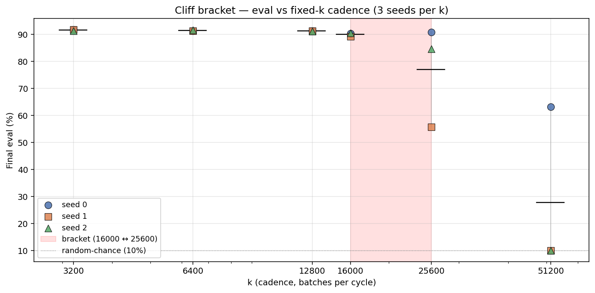
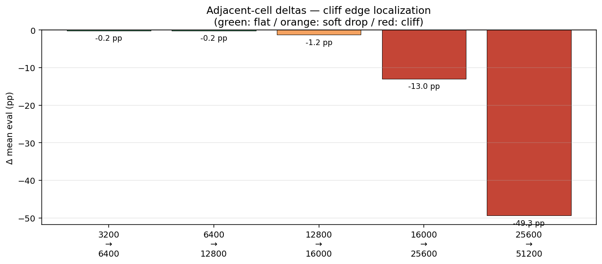

# Table — Cliff bracket (synchronization-threshold localization)

ResNet-20 / CIFAR-10 / 200 epochs / 3-GPU heterogeneous /
nccl-async / `--guard none --min-anchor=k --max-anchor=k`. Cadence
pinned at exactly `k` batches per cycle; convergence guard disabled
for the duration of every cell so the auto-tune cannot steer cadence
away from the pinned value. Sweep walks `k` across an order of
magnitude (3200 → 51200) to locate the threshold empirically.
ElChe's auto-tuned cadence saturates at k ≈ 200 in normal operation;
this sweep operates 16–250× above that setpoint.

Source: `data/cliff-bracket/aggregate.txt`, `data/cliff-bracket/analysis/per_cell.csv`.

## Per-k grid (3 seeds × 6 k values = 18 cells)

| k | within-train syncs | seed 0 | seed 1 | seed 2 | mean ± sd | range | regime |
|---:|---:|---:|---:|---:|---:|---:|---|
| 3200  | 13 | 91.76 % | 91.76 % | 91.28 % | 91.60 ± 0.28 |  0.5 pp | safe baseline |
| 6400  |  7 | 91.31 % | 91.39 % | 91.64 % | 91.45 ± 0.17 |  0.3 pp | safe |
| 12800 |  4 | 91.29 % | 91.37 % | 91.21 % | 91.29 ± 0.08 |  0.2 pp | safe |
| 16000 |  3 | 90.31 % | 89.32 % | 90.53 % | 90.05 ± 0.64 |  1.2 pp | soft pre-cliff |
| **25600** |  2 | 90.89 % | **55.80 %** | 84.58 % | **77.09 ± 18.71** | **35.1 pp** | **bimodal cliff edge** |
| 51200 |  1 | 63.22 % | 10.02 % | 10.02 % | 27.75 ± 30.72 | 53.2 pp | past cliff |



X-axis is log-scaled to span the order-of-magnitude k range. Each
seed has its own marker; per-k mean is the black tick, per-k range
is the grey vertical line. The shaded region marks the cliff bracket
(k = 16000 ↔ k = 25600) — the safe / unsafe boundary.

## Adjacent-cell deltas

| transition | Δ mean eval | verdict |
|---|---:|---|
| k = 3200 → 6400   |  −0.15 pp | flat |
| k = 6400 → 12800  |  −0.16 pp | flat |
| k = 12800 → 16000 |  −1.24 pp | soft drop (>1 pp) |
| k = 16000 → 25600 | −12.96 pp | steep drop |
| k = 25600 → 51200 | **−49.34 pp** | **cliff edge (>30 pp)** |



Δ between consecutive k values, color-coded by verdict. The cliff
edge is the first transition with Δ > 30 pp.

The cliff sits between **k = 16000 (last fully safe)** and
**k = 25600 (first bimodal)**. Three independently-seeded runs
landing at 90.89 / 55.80 / 84.58 within the same cell at k = 25600
is the basin-of-attraction signature of a noise-perturbed system
**at** the synchronization threshold — two seeds find a common basin,
one falls into a different one. At k = 51200 only 1 sync event fires
in the 200-epoch run; mean eval falls to random-chance + 18 pp,
two of three seeds collapsing exactly at random chance (10.02 %).

## Falsification of the "ride the limit" hypothesis

Within the safe regime k ∈ {3200, 6400, 12800}, eval is
**monotone non-increasing** (91.60 → 91.45 → 91.29). The hypothesis
that the eval-vs-k curve has a peak between ElChe's auto-tune
setpoint (~k = 200) and the cliff is **not supported**. The
controller story is "stay safely below the cliff" — not "target the
peak" — and the cliff localization above gives that story its
quantitative reference.

## Loss of within-cycle observability past the cliff

R1 by-k OLS is observable only at k = 3200 (LR = 0.3 window, 6 events,
slope −1.98 × 10⁻⁴ ± 1.43 × 10⁻⁴, R² = 0.235 ± 0.099). For k ≥ 6400
the analyzer skips the section because per-LR-window sync count drops
below the OLS minimum (~4 events). The disappearance of the
within-cycle Lyapunov axis is **itself a signature of crossing into
the sparse-coupling regime** — by construction, as inter-sync interval
grows past one LR window, the by-k axis degenerates. A corollary:
cross-rank Pearson r is uninformative past the cliff (reported
r ≈ 1.0 in collapsed cells is a sample-size artifact at
N ≤ 2 sync events; two points always lie perfectly on a line).
**The eval signal is the load-bearing falsifier past the cliff;** the
framing-validity gate works only in the safe regime where it's
already saturated near 1.

## Verdict

- Synchronization threshold localized to **k ∈ [16000, 25600]** for the
  ResNet-20 / CIFAR-10 / 200-epoch / 3-GPU heterogeneous regime.
- ElChe's auto-tuned cadence (k ≈ 200) operates **~80–125× below the
  cliff** — the heuristic works because it's deep in the safe regime,
  not by riding the threshold.
- The cadence axis below the cliff is monotone non-increasing in eval
  and strictly decreasing in cost; this is the clean Pareto direction
  the cliff probe locates the boundary of.

## Reproducibility

```
python3 research/elche-msf/data/cliff-bracket/aggregate.py
python3 research/elche-msf/data/cliff-bracket/analyze.py
```

Reads cell extracts in `data/cliff-bracket/`; writes
`aggregate.txt` (canonical text rollup) and `analysis/{per_cell.csv,
per_rank.csv, *.png}` (figures).
