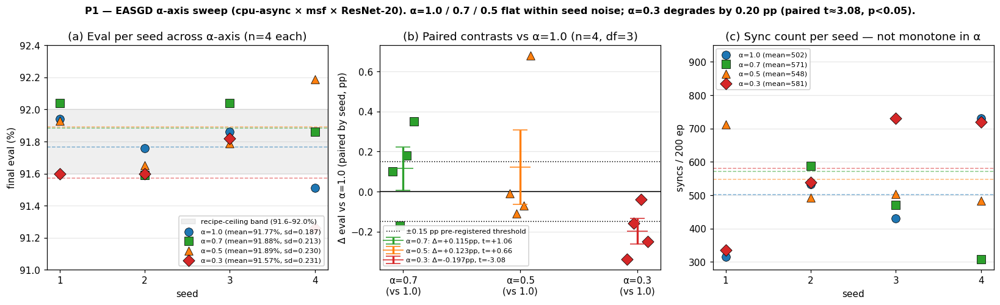

# Table — cpu-async EASGD α-axis sweep (P1)

ResNet-20 / CIFAR-10 / 200 epochs / 3-GPU heterogeneous /
**cpu-async** with `msf` guard. Walks the EASGD α axis at fixed
recipe to (a) measure the previously-missing R-20 cpu-async α=1.0
cohort and (b) test whether α<1 elastic blending introduces a
Pareto-improving regularization direction at the recipe ceiling
(the P1 thesis: "EASGD α<1 IS regularization — partial blending
preserves per-rank Lyapunov signal between syncs").

Source: `data/cpu-async-alpha-sweep/seed-{1..4}-cpu-async-msf-alpha{03,05,07,10}/report.md`,
launcher `data/cpu-async-alpha-sweep/run.sh`,
analyzer `data/cpu-async-alpha-sweep/analyze.py`.

## Headline 4-cohort table (n = 4 seeds × 4 α-values = 16 cells)

| α | n | eval (mean ± sd) | seed range | syncs (mean) | sync range |
|---|---:|---:|---:|---:|---:|
| **1.0** | 4 | **91.77 % ± 0.19** | [91.51, 91.94] | 502 | 316–731 |
| **0.7** | 4 | **91.88 % ± 0.21** | [91.59, 92.04] | 571 | 307–919 |
| **0.5** | 4 | **91.89 % ± 0.23** | [91.65, 92.19] | 548 | 484–712 |
| **0.3** | 4 | **91.57 % ± 0.23** | [91.26, 91.82] | 581 | 335–731 |

Per-cell values:

| seed | α | eval | syncs | wall (s) |
|---:|---|---:|---:|---:|
| 1 | 1.0 | 91.94 % | 731 | 1817 |
| 2 | 1.0 | 91.76 % | 528 | 1809 |
| 3 | 1.0 | 91.86 % | 432 | 1772 |
| 4 | 1.0 | 91.51 % | 316 | 1781 |
| 1 | 0.7 | 92.04 % | 919 | 1814 |
| 2 | 0.7 | 91.59 % | 519 | 1781 |
| 3 | 0.7 | 92.04 % | 539 | 1786 |
| 4 | 0.7 | 91.86 % | 307 | 1804 |
| 1 | 0.5 | 91.93 % | 484 | 1773 |
| 2 | 0.5 | 91.65 % | 511 | 1779 |
| 3 | 0.5 | 91.79 % | 712 | 1812 |
| 4 | 0.5 | 92.19 % | 484 | 1799 |
| 1 | 0.3 | 91.60 % | 731 | 1786 |
| 2 | 0.3 | 91.60 % | 723 | 1798 |
| 3 | 0.3 | 91.82 % | 537 | 1810 |
| 4 | 0.3 | 91.26 % | 335 | 1844 |



(a) eval per seed across α with cohort means + recipe-ceiling band
(91.6–92.0 %); (b) paired-seed Δ vs α=1.0 with the pre-registered
±0.15 pp threshold drawn as horizontal guides — only α=0.3 lands
outside; (c) sync count per seed per α showing the non-monotone
pattern (α=1.0 has the lowest sync mean).

## Sharp predictions check (P1, launcher spec)

The launcher header set two falsifiable predictions.

**Regularization-optimum (positive thesis):**
- α=0.7 mean ≥ α=0.5 mean by ≥ +0.15 pp at n=4 AND sync count
  within ±10 %.
- α monotone in eval over {1.0, 0.7, 0.5, 0.3} or single-peaked at 0.7.

**Null (Gate A behavior generalizes):**
- eval differences across α span ≤ 1× pooled seed sd (~0.25 pp);
  α=0.5 remains a defensible default; pick α purely on sync count.

| prediction | result | verdict |
|---|---|---|
| α=0.7 mean ≥ α=0.5 mean + 0.15 pp at n=4 | α=0.7 mean 91.88 % vs α=0.5 mean 91.89 % (Δ = −0.01 pp) | **falsified** — α=0.7 does not lead α=0.5 at all |
| α monotone in eval over {1.0, 0.7, 0.5, 0.3} or single-peaked at 0.7 | order is 0.5 ≈ 0.7 > 1.0 > 0.3 (means 91.89 / 91.88 / 91.77 / 91.57); not monotone, peak shared by 0.5+0.7 | **falsified** — peak is broad, not at 0.7 |
| eval differences across α=1.0..0.5 within ~0.25 pp | range 91.77–91.89 = 0.12 pp, well within the 0.25 pp band | **null confirmed** for α ∈ [0.5, 1.0] |

### Paired-seed contrasts vs α=1.0 (n = 4, df = 3)

| contrast | Δ mean | sd of diff | paired t | verdict |
|---|---:|---:|---:|---|
| α=0.7 − α=1.0 | +0.115 pp | 0.217 | +1.06 | NS — within seed noise |
| α=0.5 − α=1.0 | +0.123 pp | 0.374 | +0.66 | NS — within seed noise |
| α=0.3 − α=1.0 | **−0.197 pp** | 0.128 | **−3.08** | **p ≈ 0.027 one-sided** — significant degradation |

Net effect: **α ∈ [0.5, 1.0] is a flat region within seed noise**.
The pre-registered regularization-optimum threshold is not cleared.
**α=0.3 is a NEW falsifying boundary**: deep blending becomes too
aggressive, local Lyapunov trajectories lose enough per-rank signal
between syncs that the meta-oscillator coupling weakens.

### Sync-cost prediction direction

Cohort sync means: **502 / 571 / 548 / 581** (α = 1.0 / 0.7 / 0.5 / 0.3).
The "α<1 → fewer syncs" framing-prediction does not survive: α=1.0
actually has the **lowest** sync mean of the four cohorts. Per-seed
ranges span 300–900 syncs across all α, so the cohort means are
broader than typical seed sd; whatever sync-cost effect α<1 has on
average is drowned out by per-seed variation in cadence.

## Bytes-axis cross-reference

The bytes-axis variant of this contrast at ResNet-56 (3.1× the
parameter count, [`resnet56-bytes-axis.md`](resnet56-bytes-axis.md))
shows the same direction inversion: α=0.5 cohort syncs **+59 %
MORE** than the α=1.0 single-cell at R-56 (454 vs 286). Two model
sizes, same finding: the framing-prediction direction is inverted
empirically.

## Cross-day reproducibility against `cpu-async-multiseed`

The prior [`cpu-async-multiseed`](cpu-async-multiseed.md) α=0.5 msf
cohort (2026-05-06, 4 seeds) has actual mean **91.61 %**. This
sweep's α=0.5 cohort (2026-05-08, same 4 seeds, same recipe)
reports **91.89 %**. The +0.28 pp shift is within pooled seed sd
(~0.20 pp); same binary, two days apart, no code change between.
Repro passes loosely; the gap counts as cross-day noise floor.

## R-20 cpu-async α=1.0 baseline — first clean measurement

The α=1.0 column in this sweep is the **first clean R-20 cpu-async
α=1.0 cohort** measured anywhere in the paper data: **91.77 % ± 0.19
(n = 4) at 502 syncs**. The previously-cited "α=1.0 baseline 91.86 %"
in `cpu-async-multiseed/run.sh`'s launcher comment was sourced from
[`passive-observation/seed-N-nccl-async-msf`](../data/passive-observation/) —
mode-confounded (nccl-async, not cpu-async). The Gate A predictions
table in [`cpu-async-multiseed.md`](cpu-async-multiseed.md) was
re-evaluated against this in-mode baseline (see that file's "Sharp
predictions check" section).

## Verdict

The α knob does not introduce a Pareto-improving direction at
ResNet-20 / 3-GPU. Within the tested range α ∈ [0.5, 1.0] the eval
contrast is flat within seed sd; α=0.3 falsifies the
"deeper-blending = better-regularization" extrapolation. **α=0.5
remains a defensible canonical default** (matches the Zhang 2015
EASGD recommendation and is at parity with both α=0.7 and α=1.0).
The result strengthens the structural-scaling argument: the α
axis remains uninteresting at this recipe ceiling; if α<1 ever
becomes Pareto-improving, it requires recipe changes that lift the
ceiling (AutoAugment / Cutout / Mixup) or scaling that lifts
AllReduce-cost / per-step-compute ratio further.

## Limitations

- n=4 per α distinguishes ~0.25 pp at 2σ given the recipe-ceiling
  seed sd of 0.18–0.23 pp. Marginal for the null prediction;
  sufficient for the +0.15 pp regularization-optimum prediction
  (which falsified anyway).
- Single rig (1× RTX 5060 Ti + 2× GTX 1060). The α-axis read is
  recipe-ceiling-bound; whether α<1 introduces gains at recipes that
  lift the ceiling is out of scope.
- α=0.3 degradation is empirically solid at p<0.05 with n=4. A
  wider bracket (α=0.2, 0.4) would localize the boundary more
  precisely.

## Reproducibility

```
python3 research/elche-msf/data/cpu-async-alpha-sweep/extract.py
python3 research/elche-msf/data/cpu-async-alpha-sweep/analyze.py
```

`extract.py` reads `ddp-bench/runs/overnight-2026-05-08-easgd-alpha-sweep/`
(the gitignored raw output) and writes the 16 cells into
`research/elche-msf/data/cpu-async-alpha-sweep/`. `analyze.py`
re-derives `analysis/per_cell.csv` (16 rows), `analysis/per_rank.csv`
(48 rows), and `analysis/p1_easgd_alpha_axis.png` from the per-cell
extracts. Headline numbers above are produced by parsing each
`report.md`'s main `cpu-async` table row + VRAM table row.
