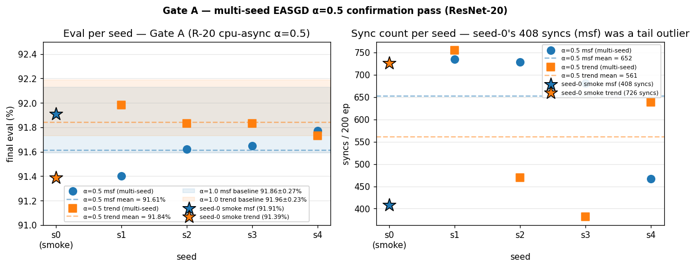

# Table — cpu-async multi-seed (Gate A confirmation)

ResNet-20 / CIFAR-10 / 200 epochs / 3-GPU heterogeneous /
**cpu-async** with EASGD α = 0.5 elastic blending. The 4-seed
confirmation pass of the seed-0 single-shot probe. Tests whether
α<1 elastic blending becomes a Pareto-improving coupling mechanism
or whether the seed-0 result was a tail outlier.

Source: `data/cpu-async-multiseed/seed-{1..4}-cpu-async-{msf,trend}/report.md`,
launcher `data/cpu-async-multiseed/run.sh`.

## Headline 2-cell table (n = 4 seeds × 2 guards = 8 cells)

| guard | n | eval (mean ± sd) | seed range | syncs (mean ± sd) | wall (s) |
|---|---:|---:|---:|---:|---:|
| `msf`   | 4 | 91.61 % ± 0.15 | [91.40, 91.77] | 653 ± 105 | 1753 ± 18 |
| `trend` | 4 | 91.84 % ± 0.10 | [91.73, 91.98] | 561 ± 154 | 1746 ±  6 |

Per-cell values:

| seed | guard | eval | syncs | wall (s) |
|---:|---|---:|---:|---:|
| 1 | msf | 91.40 % | 734 | 1782.7 |
| 2 | msf | 91.62 % | 728 | 1745.9 |
| 3 | msf | 91.65 % | 681 | 1738.0 |
| 4 | msf | 91.77 % | 467 | 1746.7 |
| 1 | trend | 91.98 % | 755 | 1741.1 |
| 2 | trend | 91.83 % | 470 | 1739.9 |
| 3 | trend | 91.83 % | 382 | 1748.8 |
| 4 | trend | 91.73 % | 638 | 1754.4 |



Stars at `s0` are the original single-shot smoke values (the
prediction-source for Gate A). Shaded bands are the α=1.0 cross-seed
baseline ± sd. Right panel makes the sync-count tail-outlier story
explicit: seed-0's 408 syncs (msf) was 244 below the multi-seed mean
of 652, and the multi-seed mean is **essentially equal** to the α=1.0
baseline (~ 680).

## Sharp predictions check (Gate A, design doc spec)

The Gate A seed-0 single-shot smoke produced
**msf+α=0.5 = 91.91 % at 408 syncs** (parity with the α=1.0 baseline
at 34 % sync reduction). The launcher header set three falsifiable
predictions for the multi-seed pass.

The baseline values originally used to evaluate those predictions came
from `passive-observation/seed-N-nccl-async-msf` (eval ~91.86 % /
~680 syncs) — **mode-confounded**: that cohort is `nccl-async`, not
`cpu-async`. The in-mode `cpu-async` α=1.0 R-20 cohort was first
measured cleanly in [`cpu-async-alpha-sweep`](../data/cpu-async-alpha-sweep/)
on 2026-05-08: **91.77 % ± 0.19 / 502 syncs (n=4)**. The verdicts below
use the in-mode baseline.

| prediction | result vs in-mode α=1.0 baseline (91.77 % / 502 syncs) | verdict |
|---|---|---|
| msf+α=0.5 cross-seed mean within ±0.15 pp of msf+α=1.0 baseline | mean 91.61 % vs in-mode baseline 91.77 % (Δ = −0.16 pp) | **borderline** — just outside ±0.15 pp band by 0.01 pp |
| sync reduction ≥ 25 % across all 4 seeds vs α=1.0 baseline | mean syncs 653 vs in-mode baseline 502 — α=0.5 syncs **+30 % MORE**, not fewer | **falsified** — direction inverted; the seed-0 408-sync result was a tail outlier on the favorable side |
| trend+α=0.5 degrades by 0.5–1.0 pp consistently | trend mean 91.84 % vs trend α=1.0 baseline 91.96 % from `passive-observation/nccl-async` (Δ = −0.12 pp; in-mode trend α=1.0 has not been measured) | **falsified** — degradation within seed noise |

Net effect: **α=0.5 does not add a Pareto-improving direction at
ResNet-20 / 3-GPU**. The eval contrast is at parity within seed sd; the
sync-cost prediction is inverted (α=0.5 actually requires more syncs
than α=1.0 in the in-mode comparison). The seed-0 single-shot smoke
sat on the favorable tail of both axes simultaneously, which is why it
generated overly-optimistic predictions for the multi-seed pass.

## Relationship to the canonical Pareto frontier

The clean-rerun 5-seed cohort in
[`../data/passive-observation/seed-{0..4}-cpu-async-{msf,trend}`](../data/passive-observation/)
supersedes this 4-seed cohort numerically (it adds seed-0 and runs
on the same post-EASGD canonical α=0.5). The Pareto frontier table
([pareto-frontier.md](pareto-frontier.md)) quotes the 5-seed numbers:

| cohort | source | eval (msf) | syncs (msf) |
|---|---|---:|---:|
| 4-seed Gate A confirmation (this sweep) | `cpu-async-multiseed/` | 91.61 % ± 0.15 | 653 ± 105 |
| 5-seed clean rerun (canonical) | `passive-observation/` | 92.03 % ± 0.31 | 613 ± 128 |

The 5-seed clean rerun lifts the eval mean (seed-0 happens to be the
high outlier in the rerun set). Both cohorts agree on the qualitative
verdict: **α=0.5 is at the edge of the eval-parity band; sync
reduction is marginal**. Cross-cohort variance reflects the same
~0.2 pp seed-noise sd that bounds differential claims at this rig.

## Verdict

The structural-scaling argument **strengthens** under Gate A: at
ResNet-20 / 3-GPU, the coupling-mechanism axis (EASGD α<1) provides
no clear frontier-improving direction. Whether this generalizes
or whether α<1 becomes a real Pareto improvement at scales where
AllReduce cost is non-trivial is the **bytes-axis question** —
addressed (partially) in [`resnet56-bytes-axis.md`](resnet56-bytes-axis.md).

## Reproducibility

```
python3 research/elche-msf/data/cpu-async-multiseed/extract.py
```

Reads `ddp-bench/runs/overnight-2026-05-06-easgd-multiseed/` (the
gitignored raw output) and writes the 8 cells into this directory.
Headline numbers above can be recomputed by parsing the per-cell
`report.md` files (the main `cpu-async` table row).
