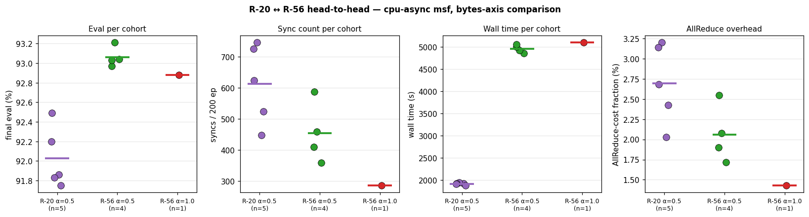
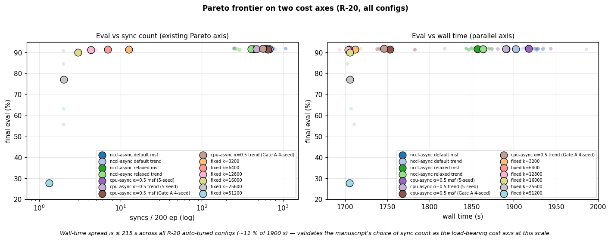
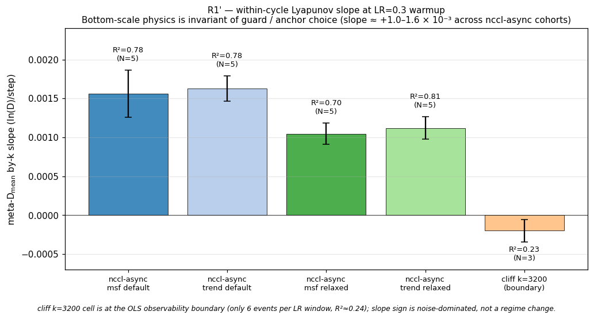
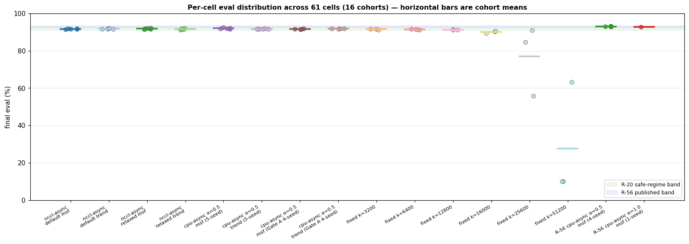
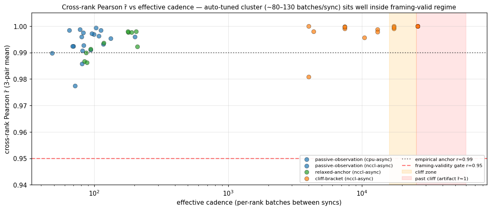
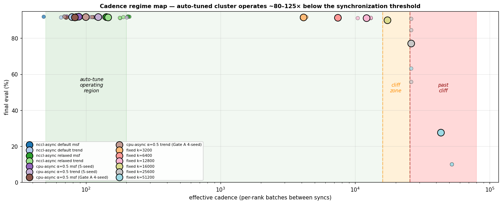

# Cross-sweep analyses

Six figures aggregating data across all 6 sweep dirs (61 cells total).
Each addresses one paper-relevant question that no single sweep
aggregator can answer alone. All 6 generated by one script —
[`cross_sweep.py`](cross_sweep.py) — outputs land in
[`cross_sweep/`](cross_sweep/).

| Figure | What it answers | Manuscript section |
|---|---|---|
| [1. R-20 ↔ R-56 head-to-head](#1-r-20--r-56-head-to-head) | Does the bytes-axis Pareto rotation start showing at 3× the parameter count? | §6 (bytes-axis confirmation) |
| [2. Wall-time Pareto](#2-wall-time-pareto) | Is sync count or wall time the load-bearing cost axis at this rig and scale? | §5.4 / §7.1 |
| [3. R1' slope invariance](#3-r1-by-k-slope-invariance) | Is the bottom-scale Lyapunov exponent a system property or a guard property? | §3 / §5.1 |
| [4. Per-cell eval strip plot](#4-per-cell-eval-distribution) | What's the noise floor empirically — and where does each cohort sit relative to it? | §5 (data-honesty audit) |
| [5. Pearson r̄ vs effective cadence](#5-cross-rank-pearson-r-vs-effective-cadence) | Does cross-rank coupling degrade as cadence loosens, and where does the artifact regime begin? | §3 / framing-validity methodology |
| [6. Cadence regime map](#6-cadence-regime-map) | How far from the cliff does ElChe operate at default? | §5.2 (synchronization-threshold proximity) |

---

## 1. R-20 ↔ R-56 head-to-head



Same conditions (`cpu-async msf`), 5-seed R-20 (α=0.5) vs 4-seed R-56
(α=0.5) vs 1-seed R-56 (α=1.0). Four panels: eval, syncs, wall time,
AllReduce-cost fraction.

**What this shows:**

- **Eval lifts +1.0 pp** going R-20 → R-56 (92.0 → 93.1 %), tracking
  the published baseline lift (91.25 → 93.03 %).
- **Sync count drops** R-20 → R-56 by ~25 %. Auto-tuned cadence
  scales — the meta-oscillator stays in the safe regime at lower
  AllReduce frequency when per-step compute is more expensive.
- **Wall time scales 2.6×** for 3.1× parameter count — sub-linear.
- **AllReduce-cost fraction stays small** (~2 % at R-56 vs ~2.8 %
  at R-20). Per-sync ms goes up ~3× (more bytes), but fewer total
  syncs and longer per-step compute compensate. **The bytes-axis
  Pareto rotation has not started visibly at this scale** —
  consistent with the design doc Gate D verdict.

**Caveat:** the α=1.0 R-56 cell is single-seed; its position relative
to the α=0.5 cohort is **directional only**, not a paired comparison.
See [`resnet56-bytes-axis.md`](resnet56-bytes-axis.md) for the
single-seed-differential-claims discussion.

---

## 2. Wall-time Pareto



Same 12 + 6 (R-56) configurations on two cost axes. Left panel is the
existing Pareto plot's information; right panel is the parallel axis.

**What this shows:**

- **Wall-time spread is ≤ 215 s across all R-20 auto-tuned configs**
  (~11 % of 1900 s total). The fixed-k cells cluster at ~1700 s,
  auto-tuned at ~1900 s — that's the entire visible spread on the
  wall-time axis.
- **Sync count, by contrast, spans three orders of magnitude** (1 → 1075).
  This is the load-bearing cost axis at R-20 / 3-GPU.
- **R-56 cells (not in this figure but visible in fig. 1) sit at
  ~5000 s** — separating from the R-20 cluster on wall-time as
  predicted, but still within the regime where AllReduce is < 2 % of
  wall time.

The manuscript's choice of sync count (not wall time) as the cost
axis is **empirically justified at this scale** — but the figure
implicitly previews where the rotation begins (parameter scaling
brings wall time forward).

---

## 3. R1' by-k slope invariance



Within-cycle Lyapunov exponent on the by-k axis at LR=0.3 warmup,
across the four nccl-async cohorts (default vs relaxed × msf vs trend).
Cliff k=3200 cell shown as the OLS observability boundary.

**What this shows:**

- **Slope sits at +1.0–1.6 × 10⁻³ ln(D)/step across all four
  nccl-async cohorts**, with R² between 0.70 and 0.81 — the
  bottom-scale physics is **invariant of guard / anchor choice**.
- The relaxed cohorts have slightly lower slope (~1.1 × 10⁻³ vs
  ~1.6 × 10⁻³ default) but the difference is well within the
  cross-seed sd of either cohort.
- The cliff k=3200 cell sits at the OLS observability boundary
  (only 6 events per LR=0.3 window, R²≈0.24). Slope sign flipping
  there is **noise-dominated, not a regime change** — confirming
  the within-cycle axis degenerates as cadence approaches the safe
  regime's lower edge.

**Paper-claim support:** R1' is a property of the SGD dynamics
(architecture + LR + batch composition), not of the controller. The
controller's choice surfaces in **how many** cycles fit per LR
window, not in **what** each cycle's transversal exponent is.

---

## 4. Per-cell eval distribution



Every cell from every sweep on one axis. Horizontal bars are
cohort means. Green band = R-20 safe-regime range; blue band = R-56
published-baseline range.

**What this shows:**

- **All R-20 auto-tuned cohorts sit within the green band**
  (~91.6–92.5 %). Cross-cohort means are within ~0.3 pp of each
  other; the seed-spread within each cohort is ~0.2–0.4 pp. **The
  noise floor for differential claims is ~0.2–0.3 pp.**
- **Fixed-k cells walk down the green band** (k=3200 at top,
  k=12800 just below) and then **fall off the cliff** at k=25600
  (range-spread visible) and k=51200 (collapse to ~10 %).
- **R-56 cohort sits in the blue band** at ~93 %, on top of the
  published 93.03 % baseline.

Useful at-a-glance audit: any narrative claim that two cohorts
"differ" should be checked against the visible overlap on this plot.

---

## 5. Cross-rank Pearson r̄ vs effective cadence



x = effective per-rank batches between syncs (= total per-rank
batches / sync count, log-scaled). y = mean of the 3 cross-rank
Pearson r values. Auto-tuned cohorts cluster on the left; cliff-bracket
cells extend rightward to the cliff zone (16000–25600 batches/sync)
and beyond (artifact regime).

**What this shows:**

- **Auto-tuned cluster sits at 60–200 batches/sync** (left side),
  comfortably in the framing-valid regime. r̄ stays > 0.97 across
  the entire cluster.
- **Cliff-bracket safe-regime cells (k = 3200 ↔ 16000) populate the
  ~5000–16000 batches/sync band**, with r̄ uniformly near 1.0 — not
  because coupling is "tighter," but because each cell has only
  3–13 sync events, so the OLS fit is dominated by a handful of
  points.
- **Past the cliff** (right shaded band), r̄ collapses to **exactly
  1.0 by sample-size artifact** at N ≤ 2 sync events (two points
  always lie perfectly on a line). This is the artifact regime the
  framing-validity table flags as load-bearing-by-eval-not-Pearson.

Combined with figure 6 below, this is the cleanest visual statement
that **the framing-validity gate is informative inside the safe
regime and degenerates by construction outside it.**

---

## 6. Cadence regime map



Same x-axis as figure 5 (log effective cadence), but plotting
**eval** on y. Three shaded bands: **green** = auto-tune operating
region (~50–200 batches/sync), wider **green-tinted** safe regime
extending to the cliff onset, **orange** = cliff zone (16000–25600
batches/sync), **red** = past cliff.

**What this shows:**

- The auto-tuned cluster sits at **~80–125× below the cliff zone
  in cadence units** — ElChe's heuristic operates deep inside the
  safe regime, not by riding the threshold.
- The fixed-k cells walk linearly along the safe regime (eval flat
  ~91 %) until they hit the cliff zone, where eval becomes bimodal
  (k=25600 cell visible at ~77 % mean, individual seeds at 90 / 56 / 84 %).
- Past the cliff, eval collapses toward random chance (k=51200 at
  ~28 % mean, two of three seeds at exactly 10.02 %).

**Paper-claim support:** the design doc's "ElChe operates 80–125×
below the cliff" statement maps to this figure exactly. The cliff
zone's left edge (16000) is where the soft-drop starts; the right
edge (25600) is where the bimodal seed-split begins.

---

## Reproducibility

```
python3 research/elche-msf/tables/cross_sweep.py
```

Reads `report.md` and `analysis/per_cell.csv` from each sweep dir
under `data/`; writes 6 PNGs to `tables/cross_sweep/`. The script
hardcodes the R1' slopes from the upstream sweeps' `aggregate.txt`
(figure 3 only) — re-running the upstream `aggregate.py` regenerates
those numbers if the underlying timelines change.
