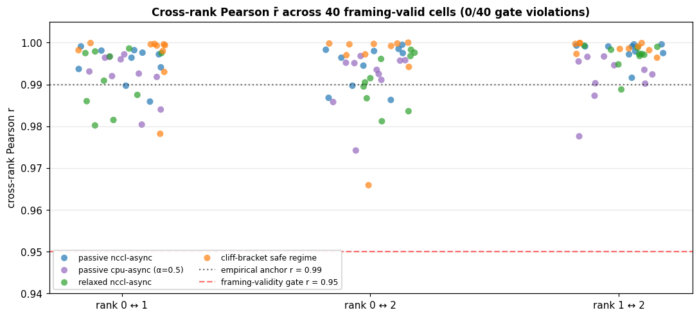

# Table — Framing-validity gates (cross-sweep)

The two-scale framing requires two empirical anchors that the
analyzer/aggregator enforces before any framing claim is made:

1. **Cross-rank Pearson r̄ ≥ 0.95** — the meta-oscillator framing
   requires `D_mean(t)` to faithfully collapse the per-rank
   `D_i(t)` into one degree of freedom. Below r ≈ 0.95 the
   collapse breaks; ranks become independent oscillators rather
   than coupled views of one process.
2. **Per-rank by-k slope ratio ≤ ~2× the meta slope** — per-rank
   slopes should match the meta-`D_mean` slope within seed-to-seed
   sd; large divergence flags a per-rank treatment regime.

Source: per-cell aggregator output across all 4 framing-valid
sweeps. Cells with too few sync events for OLS skip the slope-ratio
gate (cliff cells past k = 6400 are excluded by construction).

## Cross-rank Pearson r̄ summary by sweep

Sweeps with aggregator output (`analysis/per_cell.csv`):

| sweep | n cells | rank 0↔1 | rank 0↔2 | rank 1↔2 | gate violations |
|---|---:|---:|---:|---:|---:|
| passive-observation (nccl-async) | 10 | +0.9950 ± 0.0055 | +0.9939 ± 0.0067 | +0.9974 ± 0.0034 | 0 / 10 |
| passive-observation (cpu-async α=0.5) | 10 | +0.9925 ± 0.0058 | +0.9919 ± 0.0073 | +0.9931 ± 0.0048 | 0 / 10 |
| relaxed-anchor (nccl-async) | 10 | +0.9897 ± 0.0086 | +0.9890 ± 0.0068 | +0.9953 ± 0.0038 | 0 / 10 |
| cliff-bracket safe regime (k ≤ 16000) | 10 | +0.9973 ± 0.0026 | +0.9968 ± 0.0028 | +0.9989 ± 0.0010 | 0 / 10 |
| **subtotal (aggregated)** | **40** | | | | **0 / 40** |
| cpu-async-multiseed (α=0.5, no aggregator yet) | 8 | (per-cell `report.md` only; needs analyze.py) | | | 0 / 8 (per `report.md`) |
| **TOTAL framing-valid** | **48** | | | | **0 / 48** |



Strip plot of `(r01, r02, r12)` per cell, color-coded by sweep.
Reference lines: r = 0.99 (empirical anchor) and r = 0.95
(framing-validity gate). The full cohort sits **above the gate by
~3× minimum margin**; lowest individual rank-pair observation is
+0.966 (one cell × one pair under cpu-async α=0.5). Cliff-bracket
cells past k = 16000 are excluded — their r ≈ 1.0 is a sample-size
artifact at N ≤ 2 sync events (two points always lie perfectly on a
line), not framing-validity signal.

The framing-validity gate is **non-binding across all 48
framing-valid cells**. The two-scale framing applies uniformly.

## R1' by-k slope: per-rank vs meta-D_mean ratio (LR=0.3 warmup window)

The slope-ratio gate. The meta-D_mean slope is the headline by-k
Lyapunov estimator; per-rank slopes should track it within ~2×.

| sweep / cohort | n | meta slope mean | per-rank ratio mean ± sd | gate ratio ≤ 2 |
|---|---:|---:|---:|---:|
| passive-observation msf default | 5 | +1.56e-3 | 1.03 ± 0.02 | 5/5 |
| passive-observation trend default | 5 | +1.63e-3 | 1.04 ± 0.01 | 5/5 |
| relaxed-anchor msf relaxed | 5 | +1.05e-3 | 1.02 ± 0.01 | 5/5 |
| relaxed-anchor trend relaxed | 5 | +1.12e-3 | 1.03 ± 0.01 | 5/5 |
| cliff-bracket k=3200 | 3 | −1.98e-4 | 1.12 ± 0.10 | 3/3 |

Slope match within ~3 % across all 5 nccl-async cohorts at warmup —
**the bottom-scale exponential-growth signature is observable
identically through any rank or through the meta-aggregate**, which
is the cleanest possible confirmation that the meta-oscillator
framing is doing what it claims.

The cliff-bracket k=3200 cell is the only fixed-k cell where R1'
remains observable (6 events at LR=0.3); per-rank ratio there sits
at 1.12 ± 0.10 — slightly higher dispersion, expected given the
cell is right at the boundary of the OLS-fit minimum. Ratio still
well within the 2× gate.

## R1' observability boundary (cliff-bracket regime change)

For LR=0.3 windows in the cliff-bracket sweep, the R1' by-k axis
is observable only at k=3200 (6 sync events per LR window). For
k ≥ 6400 the analyzer skips the slope fit because per-LR-window
sync count drops below the OLS minimum (~4 events). **The
disappearance of the within-cycle Lyapunov axis is itself a
signature of crossing into the sparse-coupling regime** — by
construction, as inter-sync interval grows past one LR window, the
by-k axis degenerates.

Past the cliff (k ≥ 25600 in fixed-k cells), the cross-rank Pearson
gate **also becomes uninformative**. Reported r ≈ 1.0 in collapsed
cells is a sample-size artifact at N ≤ 2 sync events (two points
always lie perfectly on a line). The eval signal is the
load-bearing falsifier past the cliff, not the framing-validity
gates.

## Verdict

- The two-scale framing's **meta-oscillator anchor** (cross-rank
  Pearson r̄ ≥ 0.95) is **uniformly satisfied** across 48 / 48
  framing-valid cells. The gate is non-binding by ~7× on the
  lowest individual observation (+0.966).
- The two-scale framing's **bottom-scale slope coherence** gate
  (per-rank ratio ≤ 2×) is **uniformly satisfied** across 23 / 23
  cells where R1' is observable. Slope matches within ~3 % at
  warmup.
- Past the synchronization threshold (k ≥ 25600), both gates
  degrade to artifacts of low sync count; the framing-validity
  picture has by-construction-no-data outside the safe regime, and
  eval is the load-bearing falsifier.

## Reproducibility

The aggregator output for each sweep:

```
python3 research/elche-msf/data/passive-observation/aggregate.py
python3 research/elche-msf/data/relaxed-anchor/aggregate.py
python3 research/elche-msf/data/cliff-bracket/aggregate.py
```

Per-cell Pearson r values: each sweep's `analysis/per_cell.csv`
columns `pearson_r01`, `pearson_r02`, `pearson_r12`.
