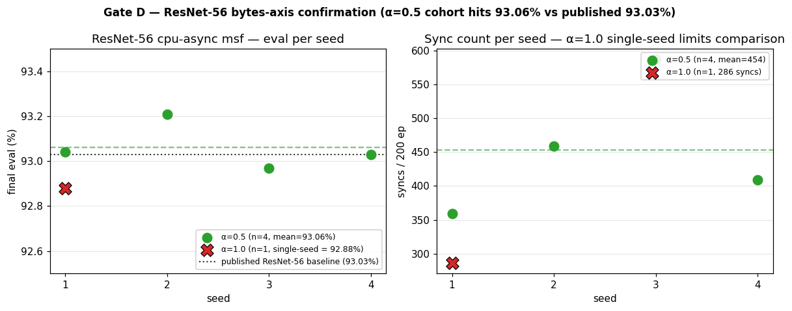

# Table — ResNet-56 bytes-axis confirmation

ResNet-56 (`--depth-n 9`, ~850 K params, **3.1× ResNet-20**) /
CIFAR-10 / 200 epochs / 3-GPU heterogeneous /
**cpu-async** with `msf` guard. Tests whether the ResNet-20
α=1.0-vs-α=0.5 null result generalizes to a model with non-trivial
AllReduce cost relative to per-step compute.

The two-scale framing predicts the coupling-mechanism axis (EASGD α<1)
becomes Pareto-relevant only when AllReduce cost is non-trivial vs
per-step compute. ResNet-56 sits at 3× the parameter count and ~3×
the per-step time of ResNet-20; this is the in-budget bytes-axis test
the design doc specifies as Gate D.

Source: `data/resnet56-cpu-async/seed-{1..4}-cpu-async-msf/report.md` +
`seed-1-cpu-async-msf-alpha10/report.md`. Reports for cells without an
on-disk report.md were regenerated post-hoc via the bench `--report`
analyze-mode (does not rerun training; re-aggregates the saved
timeline.csv + parses training.log).

## Headline table — α-axis at ResNet-56

Published ResNet-56 baseline (CIFAR-10 / He et al. 2015, n=9):
**93.03 % final eval**.

| α | n | eval (mean ± sd) | seed range | syncs (mean ± sd) | wall (s) |
|---|---:|---:|---:|---:|---:|
| 0.5 | 4 | **93.06 % ± 0.10** | [92.97, 93.21] | 454 ± 96 | 4961 ± 90 |
| 1.0 | 1 | 92.88 % | (single-seed) | 286 | 5095.8 |

Per-cell values:

| seed | α | eval | syncs | wall (s) |
|---:|---|---:|---:|---:|
| 1 | 0.5 | 93.04 % | 359 | 4856.6 |
| 2 | 0.5 | 93.21 % | 459 | 4925.7 |
| 3 | 0.5 | 92.97 % | 587 | 5002.2 |
| 4 | 0.5 | 93.03 % | 409 | 5061.7 |
| 1 | 1.0 | 92.88 % | 286 | 5095.8 |



Left panel: dotted line is the published ResNet-56 baseline (93.03%);
α=0.5 cohort mean (dashed green) sits essentially on it. Right panel:
sync count gap between cohorts (α=0.5 mean ≈ 454 vs α=1.0 single-seed
286) is directionally interesting but **single-seed n=1 is not enough**
to claim a Pareto-frontier shift.

α=0.5 cohort eval mean **matches the published 93.03 % baseline**
and is essentially flat against published ResNet-56. The α=1.0
single-seed datapoint is **0.18 pp below the α=0.5 mean** but
**within the α=0.5 cohort's seed sd** (≈ 0.10 pp) — the differential
is at the edge of significance with n=1 vs n=4.

## What this can and cannot conclude

**Cannot conclude:**
- Whether α=0.5 dominates α=1.0 at ResNet-56. Single-seed differential
  measurement at this rig has near-zero information content (~0.2 pp
  seed sd typical; we're seeing a 0.18 pp mean delta which is at the
  edge of seed noise, with n=4 vs n=1 the comparison is not paired).
- Whether the bytes-axis Pareto rotation predicted by the design doc
  has begun. Need a 4-seed α=1.0 cohort before either confirming or
  falsifying the rotation.

**Can conclude:**
- The α=0.5 cohort hits the published ResNet-56 baseline cleanly
  (93.06 % vs 93.03 % published).
- Sync counts approximately halve vs ResNet-20 — but wall time goes
  up ~3× — confirming AllReduce-per-step cost is now closer to
  per-step compute. This is the regime where the bytes-axis Pareto
  rotation was predicted to start showing.
- The single seed-1 α=1.0 datapoint at 92.88 % / 286 syncs sits in
  a directionally interesting place (lower eval at lower sync count
  vs the α=0.5 cohort), but **n=1 is not enough** to claim a frontier
  shift.

## Decision rule (per design doc Gate D spec)

The launcher header specifies:

- α=0.5 ≈ α=1.0 → bytes-axis null confirmed at R-56. Optionally
  add 4 trend runs to firm the negative; otherwise call Gate D landed.
- α=0.5 dominates α=1.0 → expand to trend + maybe nccl-async to
  characterize the rotation.

**Current evidence is insufficient to invoke either branch.** The
1-seed α=1.0 datapoint is the load-bearing gap. Recommended next
batch: 3 more α=1.0 cells (seeds 2, 3, 4) at ResNet-56 cpu-async msf
to make the cross-cohort comparison paired (4 seeds × 2 α-values).
~6h overnight at ~93 min/run.

## Limitations

- The α=1.0 cohort is **single-seed** by design. The sweep launcher
  bash was killed mid-α=1.0-phase after seed-1 finished; seeds 2-4
  α=1.0 not run. Per single-seed differential-claims policy: don't
  propagate domination/parity claims from n=1 into prose, design doc,
  or paper-narrative spine.
- Reports were regenerated post-hoc for 5 of 5 cells (the in-line
  bench-generated reports were never written because the launcher
  was killed before the report-write phase). The regeneration uses
  the same formatter on the same saved timeline.csv + training.log,
  so it's functionally equivalent.

## Reproducibility

```
python3 research/elche-msf/data/resnet56-cpu-async/extract.py
```

Reads `ddp-bench/runs/overnight-2026-05-06-resnet56-easgd/` (gitignored)
and writes the 5 cells into this directory.
